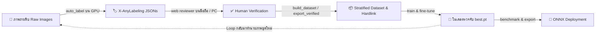

<div align="center">

# ⚡ YOLO Training & Dataset Toolkit

**Universal All-in-One CLI Toolkit for Object Detection, Dataset Preparation, Human-in-the-Loop Web Review, and YOLO Training**

[](https://www.python.org/downloads/)
[](https://github.com/ultralytics/ultralytics)
[](LICENSE)
[]()

[คู่มือการใช้งาน (Docs)](#-สารบัญเอกสารคู่มือ-documentation) • [การติดตั้ง](#-การติดตั้งและสภาพแวดล้อม-installation) • [เริ่มต้นใช้งานทันที](#-เริ่มต้นใช้งานทันที-quickstart) • [คำสั่งทั้งหมด](#-สรุปคำสั่ง-cli-overview)

</div>

---

## 📖 ภาพรวมระบบ (Overview)

**YOLO Training Toolkit** เป็นชุดเครื่องมือแบบครบวงจร (All-in-One CLI) สำหรับนักพัฒนา AI / Computer Vision ที่ต้องการสร้างไปป์ไลน์ตรวจจับวัตถุ (Object Detection) ตั้งแต่ขั้นตอนจัดการภาพดิบ ไปจนถึงการได้โมเดลพร้อมนำไปใช้งานจริงบน Production รองรับทั้ง **Axis-Aligned Bounding Box (`detect`)** และ **4-Point Oriented Bounding Box (`obb`)**

เครื่องมือนี้เชื่อมต่อการทำงานระหว่าง **X-AnyLabeling**, **FastAPI Local Web Reviewer**, และ **Ultralytics YOLO** เข้าด้วยกันอย่างสมบูรณ์แบบ ช่วยลดระยะเวลาในการจัดเตรียมและคัดกรองข้อมูลลงมากกว่า 80%



---

## 🌟 จุดเด่นสำคัญ (Key Highlights)

| คุณสมบัติ | รายละเอียด |
|---|---|
| 🔄 **Universal Object Detection** | ใช้เทรนวัตถุใดๆ ก็ได้ที่เป็น Bounding Box (`detect`) หรือ 4-Point Polygon (`obb`) |
| ⚡ **Zero-Copy NTFS Hardlink** | จัดเตรียมชุดภาพเข้า Train/Val/Test โดย **ไม่เปลืองพื้นที่ดิสก์ซ้ำซ้อน** และเร็วทันทีระดับเสี้ยววินาที |
| 🛡️ **Gold Standard Data Split** | คัดกรองไฟล์ที่มนุษย์ตรวจสอบแล้ว (`checked: true`) ให้เป็น Validation / Test เสมอ เพื่อวัดผลจริงไร้ Noise |
| 📱 **Mobile & PC Web Reviewer** | ตรวจทานและแก้ไข Bbox ได้ทุกที่ผ่านเบราว์เซอร์มือถือ (Fullscreen + Gestures) หรือจอ PC |
| 🚀 **High-Speed GPU Auto-Labeling** | รัน Batch Inference บน GPU เพื่อสร้างไฟล์ JSON สำหรับ X-AnyLabeling ทั้งโฟลเดอร์อัตโนมัติ |
| 📤 **Seamless ONNX Export** | แปลงโมเดลเป็น `.onnx` พร้อมสร้างไฟล์ `custom_model.yaml` สำหรับโหลดเข้า X-AnyLabeling ได้ทันที |

---

## 📁 โครงสร้างโปรเจกต์ (Project Structure)

```text
yolo_training/
├── main.py                  # CLI Entrypoint หลัก รวมทุกคำสั่ง
├── requirements.txt         # รายการแพ็กเกจ Python
├── LICENSE                  # MIT License
├── README.md                # เอกสารแนะนำและภาพรวม
│
├── docs/                    # 📚 เอกสารคู่มือการใช้งานแบบละเอียด
│   ├── 01_build_dataset.md  # การสร้าง Dataset, Stratified Split & Hardlink
│   ├── 02_training.md       # การเทรนโมเดล, Fine-Tuning, Resume & Augmentation
│   ├── 03_benchmark_and_export.md # การวัดผล Benchmark, แปลงฟอร์แมต & Export ONNX
│   ├── 04_auto_label.md     # การรัน GPU Auto-Labeling แบบ Batch
│   ├── 05_web_reviewer.md   # คู่มือ Web Annotation Reviewer (Mobile & PC)
│   ├── 06_export_verified.md# การคัดแยก/Hardlink เฉพาะไฟล์ที่ตรวจสอบแล้ว
│   └── 07_obb_techniques.md # เทคนิคสำหรับโมเดล 4-Point OBB & Perspective Warp
│
├── core/                    # ระบบประมวลผลภายใน (Modular Engine)
│   ├── dataset_builder.py   # จัดสรร dataset, stratified split, hardlink, obb converter
│   ├── trainer.py           # สั่งเทรนโมเดล YOLO & จัดการ Augmentation
│   ├── benchmarker.py       # รัน evaluation วัดผล mAP
│   ├── converter.py         # แปลง format สลับ TXT <-> JSON
│   ├── exporter.py          # Export ONNX พร้อมสร้าง config yaml
│   ├── auto_labeler.py      # Batch inference GPU auto-labeling
│   ├── verified_exporter.py # คัดแยกและส่งออกไฟล์ที่ยืนยันแล้ว
│   └── web/                 # Web Application (FastAPI + HTML5 Canvas)
│
├── raw_datasets/            # ข้อมูลดิบจาก X-AnyLabeling (ภาพ + JSON)
├── datasets/                # ข้อมูลพร้อมเทรนที่ระบบสร้างขึ้น (Hardlinked)
└── runs/                    # ผลลัพธ์และ Checkpoints จากการเทรน
```

---

## 💻 การติดตั้งและสภาพแวดล้อม (Installation)

### 1. โคลน Repository
```powershell
git clone https://github.com/your-username/yolo-training-toolkit.git
cd yolo-training-toolkit
```

### 2. เตรียม Python Environment (แนะนำ Conda หรือ venv)
```powershell
# สร้าง Environment ใหม่ (Python 3.10 ขึ้นไป)
conda create -n yolo python=3.10 -y
conda activate yolo

# ติดตั้ง Dependencies
pip install -r requirements.txt
```

### 3. ตรวจสอบการติดตั้ง
```powershell
python main.py --help
```

---

## ⚡ เริ่มต้นใช้งานทันที (Quickstart)

ไปป์ไลน์การทำงานมาตรฐานแบ่งออกเป็น 4 ขั้นตอนง่ายๆ:

### ขั้นตอนที่ 1: รัน Auto-Label บนรูปภาพใหม่ด้วย GPU
```powershell
python main.py auto_label --model yolo11n.pt --images raw_datasets/images/ --output raw_datasets/labels/ --batch 16
```

### ขั้นตอนที่ 2: เปิด Web Tool ตรวจทานและแก้ไข Bbox บนมือถือหรือ PC
```powershell
python main.py web --images raw_datasets/images --labels raw_datasets/labels --classes classes.txt --port 8000
```
> เข้าใช้งานผ่านเบราว์เซอร์ `http://localhost:8000` (หรือผ่าน IP เครื่องในวง LAN บนมือถือ) เพื่อตรวจสอบและกดยืนยัน (`checked: true`)

### ขั้นตอนที่ 3: สร้าง Dataset สำหรับเทรน (พร้อม Hardlink & Gold Standard Split)
```powershell
python main.py build_dataset --xanylabeling raw_datasets/images raw_datasets/labels --split 80/10/10 --task detect
```

### ขั้นตอนที่ 4: สั่งเทรนโมเดล YOLO
```powershell
python main.py train --model yolo11n.pt --data data.yaml --epochs 100 --batch 16 --device 0
```

---

## 📚 สารบัญเอกสารคู่มือ (Documentation)

รายละเอียดและพารามิเตอร์ของแต่ละคำสั่งถูกแยกไว้ในโฟลเดอร์ [`docs/`](docs/) เพื่อความสะดวกในการศึกษา:

| หัวข้อ | คำสั่ง CLI | รายละเอียดเอกสาร |
|---|---|---|
| **01. Dataset Builder** | `build_dataset` | [📖 อ่านคู่มือการสร้าง Dataset](docs/01_build_dataset.md) <br> *(Negative Samples, Hardlinks, Stratified Split, Verification-Aware Split)* |
| **02. YOLO Training** | `train` | [📖 อ่านคู่มือการเทรนและ Fine-Tuning](docs/02_training.md) <br> *(Pretrained weights, Backbone Freezing, Resume, Data Augmentation)* |
| **03. Evaluation & Export** | `benchmark`, `convert`, `export` | [📖 อ่านคู่มือ Benchmark และ Export](docs/03_benchmark_and_export.md) <br> *(การวัดค่า mAP, แปลง TXT <-> JSON, ส่งออก ONNX สำหรับ AnyLabeling)* |
| **04. GPU Auto-Labeling** | `auto_label` | [📖 อ่านคู่มือ Batch GPU Auto-Labeling](docs/04_auto_label.md) <br> *(สร้าง Annotation JSON ทั้งโฟลเดอร์บน GPU แบบ Batch FP16)* |
| **05. Web Reviewer** | `web` | [📖 อ่านคู่มือ Web Annotation Reviewer](docs/05_web_reviewer.md) <br> *(UI แนวนอน, คีย์ลัด PC, Gesture มือถือ, PWA Fullscreen, Color Picker)* |
| **06. Verified Exporter** | `export_verified` | [📖 อ่านคู่มือการคัดแยกไฟล์ที่ตรวจแล้ว](docs/06_export_verified.md) <br> *(Hardlink/Copy/Move เฉพาะคู่ไฟล์ที่ยืนยันแล้ว และแปลงเป็น YOLO .txt)* |
| **07. 4-Point OBB** | `--task obb` | [📖 อ่านคู่มือเทคนิค 4-Point OBB](docs/07_obb_techniques.md) <br> *(การตรวจจับวัตถุหมุน/เอียง และการทำ Perspective Warp ดัดภาพตรง)* |

---

## 🛠️ สรุปคำสั่ง CLI (CLI Overview)

| คำสั่ง (Subcommand) | ตัวอย่างการเรียกใช้งาน | วัตถุประสงค์ |
|---|---|---|
| `build_dataset` | `python main.py build_dataset -x img/ lbl/ -s 80/10/10` | สร้างชุด Train/Val/Test พร้อม Hardlink |
| `train` | `python main.py train -m yolo11n.pt -d data.yaml -e 100` | สั่งเทรนโมเดลตรวจจับวัตถุ |
| `benchmark` | `python main.py benchmark -w best.pt -d data.yaml --split test` | ประเมินผล mAP50 และ mAP50-95 |
| `convert` | `python main.py convert -d data.yaml --mode txt_to_json` | สลับฟอร์แมตระหว่าง YOLO TXT และ AnyLabeling JSON |
| `export` | `python main.py export -w best.pt --imgsz 640` | แปลงโมเดลเป็น ONNX พร้อม AnyLabeling YAML |
| `auto_label` | `python main.py auto_label -m best.pt -i images/ --batch 16` | รันโมเดลทำ Annotation อัตโนมัติบน GPU |
| `web` | `python main.py web -i images/ -l labels/ -c classes.txt` | เปิด Web UI ตรวจสอบและแก้ไข Bbox |
| `export_verified` | `python main.py export_verified -i img/ -l lbl/ -o verified/` | ดึงเฉพาะไฟล์ที่ตรวจสอบแล้วส่งออกเป็น Hardlink |

---

## 🤝 เครดิตและการอ้างอิง (Credits & Acknowledgments)

ขอขอบคุณเครื่องมือ Open-Source คุณภาพสูงที่ทำให้โปรเจกต์นี้เกิดขึ้นได้:

* **[Ultralytics YOLO](https://github.com/ultralytics/ultralytics)**: สถาปัตยกรรมโมเดล Deep Learning สำหรับ Real-time Object Detection และ OBB
* **[X-AnyLabeling](https://github.com/CVHub520/X-AnyLabeling)**: โปรแกรม Annotation ชั้นนำ และฟอร์แมต JSON มาตรฐาน
* **[FastAPI](https://fastapi.tiangolo.com/)** & **[Uvicorn](https://www.uvicorn.org/)**: เว็บเฟรมเวิร์กประสิทธิภาพสูงสำหรับรัน Local Web Annotation Reviewer
* **[OpenCV](https://opencv.org/)** & **[Pillow](https://python-pillow.org/)**: ไลบรารีประมวลผลรูปภาพและจัดทำ Perspective Transformations

---

## 📄 สัญญาอนุญาต (License)

โปรเจกต์นี้เผยแพร่ภายใต้สัญญาอนุญาต **[MIT License](LICENSE)** สามารถนำไปใช้งาน ปรับปรุง และต่อยอดได้ทั้งในเชิงพาณิชย์และงานวิจัย
